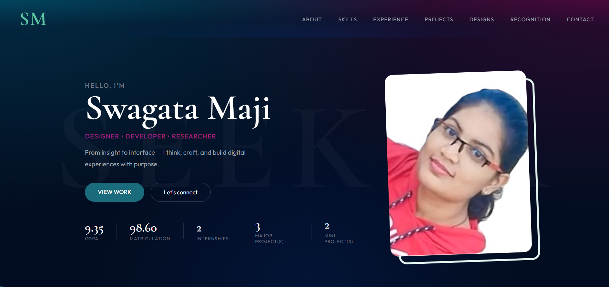

# Swagata Maji — Portfolio

### Designer · Developer · Researcher

*From insight to interface — I think, craft, and build digital experiences with purpose.*

---

## 👋 About This Portfolio

This is my personal portfolio website — designed and built entirely from scratch, without any frameworks or templates. It showcases my journey as a B.Tech student at C. V. Raman Global University (CGPA 9.35), combining my work across graphic design, coding, web development, and applied research.

The portfolio is a deliberate design artefact in itself — every section, interaction, and typographic decision was made intentionally. So right here, I'll guide you through each part of it. Hope you'll enjoy! 🙂

---

## ✨ Features

- **Custom cursor**: dual-layer cursor with smooth mouse-follow animation
- **Scroll-reveal animations**: elements animate in using `IntersectionObserver` (no library)
- **Animated stat counters**: CGPA, scores, and project counts count up on scroll
- **Skill carousel**: 3D positional card carousel built with pure CSS transforms
- **Experience lightbox**: click internship certificates to view full-size with prev/next navigation and keyboard support 
- **Conveyor-belt design strip** — auto-scrolling poster animation that pauses on hover
- **EmailJS contact form**: functional contact form with real email delivery
- **Mobile-responsive**: hamburger nav, fluid grids, and responsive typography

---

## 🗂️ Sections

| Section | What's Inside |
|---|---|
| **Hero** | Name, role tagline, animated stats, CTA buttons |
| **About** | Bio, education cards with animated progress bars, contact links |
| **Skills** | Carousel of 4 skill categories: Design, Tools, Core Skills, Technical |
| **Experience** | Internship details with certificate lightbox (InAmigos, Proxenix) |
| **Projects** | 3 major + 2 self-initiated projects with tech stacks and GitHub links |
| **Designs** | Auto-scrolling poster strip |
| **Recognition** | Certificates and achievements gallery wall |
| **Contact** | Working contact form + social links |

---

## 🛠️ Tech Stack

| Layer | Technology | Why |
|---|---|---|
| Structure | HTML5, Semantic markup | Accessibility and SEO |
| Styling | CSS3, Custom properties, Keyframe animations | Zero dependency, full control |
| Logic | Vanilla JavaScript ES6+ | No framework overhead |
| Email | EmailJS | Client-side email without a backend |
| Fonts | Cormorant Garamond + Outfit | See design decisions below |
| Icons | Inline SVG | Crisp at any resolution, no requests |

---

## 🎨 Design Decisions

**Typography — Cormorant Garamond + Outfit**
- Cormorant Garamond (display) brings editorial authority and warmth giving a "creative professional" effect while Outfit (body/UI) pairs cleanly without competing. 

**Colour — Teal + Magenta on Dark Navy**
- The dark navy base (`#0a1628`) reads as serious and focused. Teal (`#00897b`) is the primary action colour — it signals "designer" without the over-used purple/indigo of most dev portfolios. Magenta (`#d4006e`) is used sparingly as an accent, only for role labels and active states.

**Section transitions — dark → light → dark**
- The alternating light/dark section backgrounds create a contrast in section changes, depicting a designer's ability to balance a dark intense depth alongside a light-colored cheerful & happy feel. There is also an ironic use given to the implementation of the dark sections in a lighter way which is far different from the light sections carrying themselves in a radiant way.

**Interactions — no animation library**
- Every animation (scroll-reveal, counters, carousel, parallax) is written in vanilla JS using `IntersectionObserver` and `requestAnimationFrame`. This keeps the bundle at 0 dependencies and demonstrates my understanding of animations.

---

## 🗺️ Roadmap

- [ ] Dark / light mode toggle
- [ ] PWA manifest for installability

---

## 📄 License

This project is open source under the [MIT License](LICENSE).
You're welcome to draw inspiration from the code — but please don't copy the content, bio, or design work. That's mine. 🙂

---

**Designed & built by Swagata Maji · Bhubaneswar, Odisha**

*If you're a recruiter or collaborator reading this — Hello! Feel free to reach out at [majiswagata450@gmail.com](mailto:majiswagata450@gmail.com)*
